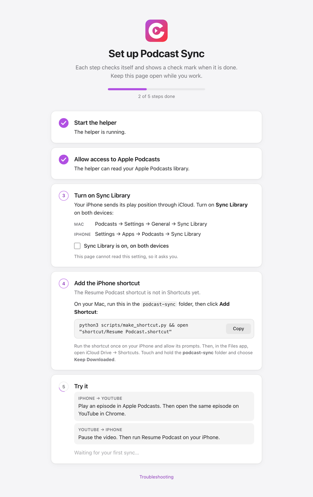

# Podcast Sync

**Watch a podcast on YouTube at your desk, then keep listening in Apple Podcasts on your iPhone, from the same second. And back again.**

Many podcasts publish the same episode twice: as video on YouTube and as audio in Apple Podcasts. The two apps do not share your position. Podcast Sync connects them, without accounts, servers, or a YouTube subscription.

| On YouTube, after you listened on your iPhone | On YouTube, when you pause |
|---|---|
|  |  |

## How you use it

- **iPhone → YouTube:** open the episode on YouTube in Chrome. It jumps to where you stopped in Apple Podcasts. An **Undo** button is there if you do not want the jump.
- **YouTube → iPhone:** pause the video, then tap the **Resume Podcast** shortcut on your iPhone. Apple Podcasts opens the episode with **Play from 13:40**.
- **Newest wins:** a position moves to the other side only when it is newer than the last position from that side.

It works for any show you follow in Apple Podcasts that also posts full episodes on YouTube. There is nothing to configure: the first time you watch an episode, the helper finds the show and remembers the channel.

## Requirements

- A Mac with Apple Podcasts signed in to the same Apple Account as your iPhone, and **Settings → Sync Library** turned on in Podcasts.
- Google Chrome (or another Chromium browser that can load unpacked extensions: Arc, Brave, Edge).
- An iPhone with Apple Podcasts, Shortcuts, and iCloud Drive.
- Apple's command line tools, for `python3` and `clang`: `xcode-select --install`.

Tested on macOS 26 and iOS 26.

## Install

```bash
git clone https://github.com/Savar-G/podcast-sync.git
cd podcast-sync
./scripts/install.sh
```

1. **Helper.** `install.sh` builds a small background app, **Podcast Sync Helper**, and starts it at login. macOS asks once to let it "access data from other apps". Click **Allow**: this lets it read the Apple Podcasts library on your Mac.
2. **Chrome extension.** Open `chrome://extensions`, turn on **Developer mode**, click **Load unpacked**, and choose the `extension` folder. Reload any open YouTube tabs.

   A setup page opens when you load the extension. It checks each step by itself and shows what is left to do. To open it again, right-click the Podcast Sync icon and choose **Options**.

   

3. **iPhone shortcut.** On your Mac, run:
   ```bash
   python3 scripts/make_shortcut.py && open "shortcut/Resume Podcast.shortcut"
   ```
   Click **Add Shortcut**. iCloud syncs it to your iPhone. Run it once on the iPhone and allow its prompts. For one tap, add it to your Home Screen or the Action Button, or make an automation: *When AirPods connect → Run Resume Podcast*.

## How it works

```
 Chrome extension ──► Podcast Sync Helper (127.0.0.1:47321, on your Mac)
  reads the YouTube      │ ├─ reads the Apple Podcasts library on this Mac (read-only)
  player time            │ │    iCloud keeps your iPhone's position in it
                         │ └─ writes a "resume here" link to iCloud Drive
                         ▼
             iCloud Drive/Shortcuts/podcast-sync/resume.txt ──► "Resume Podcast" on iPhone
```

- **Matching.** YouTube and podcast titles often differ ("From HOA Management to $4B…" on YouTube is "Bringing AI to the Real Economy" in Podcasts). The helper matches on length, publish date, and shared title words, usually the guest's name. It allows for up to 5 minutes of extra ads in the audio. On a test set of 33 recent videos from 5 shows, it matched every full episode and rejected every clip.
- **Fresh iPhone positions.** The Mac pulls positions from iCloud only while the Podcasts app runs. The helper opens Podcasts hidden, waits about 2–3 seconds for the sync, and quits it after 10 idle minutes. It never quits a Podcasts window that you opened.
- **The iPhone link** is a standard Apple Podcasts link with a time (`…?i=<episode>&t=820`), which Apple Podcasts opens at that time.

## Privacy and security

- **Everything stays on your Mac and in your own iCloud.** No servers, no accounts, no analytics.
- The helper opens the Podcasts library **read-only**. It never changes your library.
- For the setup page, the helper checks if a shortcut named "Resume Podcast" exists (`shortcuts list`), and reads the time Podcasts last synced with iCloud. It does not save or send this data.
- The only network requests: the helper loads the public YouTube page of a video you open (for its channel, length, and date), and Apple's public podcast lookup API when an episode is too new for your Mac library.
- The helper listens on `127.0.0.1` only. It accepts requests from this extension (its ID is pinned in `manifest.json`) or from a local tool such as `curl`. It refuses web pages, other extensions, and DNS-rebinding attempts.
- The extension can talk only to `http://127.0.0.1:47321` and runs only on `youtube.com`.
- Local files: `~/Library/Application Support/podcast-sync/` (match cache), `~/Library/Logs/podcast-sync.log`, and the link file in iCloud Drive.

## Settings (optional)

No config is needed. To pin a channel or fix a show whose audio is always ahead of or behind the video, copy [`config.example.json`](config.example.json) to `~/.config/podcast-sync/config.json`, then run `./scripts/install.sh` again.

| Key | Meaning |
|---|---|
| `shows[].offset_seconds` | YouTube time minus Podcasts time, for example `90`. |
| `shows[].youtube_channels`, `apple_ids` | Pin a YouTube channel ID to Apple Podcasts show IDs. |
| `min_video_seconds` | Shorter videos (clips) are ignored. Default `600`. |
| `podcasts_idle_quit_seconds` | How long a hidden Podcasts app stays open. Default `600`. |

## Troubleshooting

| Symptom | Fix |
|---|---|
| Nothing happens on YouTube | Reload the tab: Chrome adds the extension only to pages loaded after you install it. Click the extension icon to see the helper status. |
| "macOS has not allowed it to read Podcasts" | Open **System Settings → Privacy & Security** and allow Podcast Sync Helper, or run `./scripts/install.sh` again and click **Allow**. |
| The video does not jump | Your last YouTube session for that episode is newer than your iPhone listen, or you are within 15 seconds of the iPhone position. |
| The Shortcut says the file could not be opened | In the Files app, open **iCloud Drive → Shortcuts → podcast-sync**, tap `resume.txt` once, then touch and hold the folder and choose **Keep Downloaded**. |
| Anything else | `tail -f ~/Library/Logs/podcast-sync.log` |

## Uninstall

```bash
./scripts/uninstall.sh
```

Then remove the extension in `chrome://extensions` and the shortcut in Shortcuts.

## Development

```bash
python3 -m unittest discover -s tests     # matcher on real titles, sync rules, HTTP security, Podcasts timing
npm install && npx playwright-core install chromium
./scripts/e2e.sh                          # real Chromium + extension + YouTube, against a fake library
```

`e2e.sh` stops your installed helper, runs a throwaway one with a fake Podcasts library, and starts yours again. It never touches your real state, Podcasts app, or iCloud files.

| Path | What |
|---|---|
| `helper/podsync/` | The helper: Python standard library only |
| `extension/` | Chrome extension (Manifest V3) |
| `scripts/` | Install, uninstall, Shortcut builder, app launcher, e2e runner |
| `tests/` | Unit tests and fixtures; `tests/e2e/` browser test |

Podcast Sync is not affiliated with Apple, Google, or YouTube. It reads data that Apple Podcasts stores on your Mac, and Apple can change that format at any time.

## License

[MIT](LICENSE)
